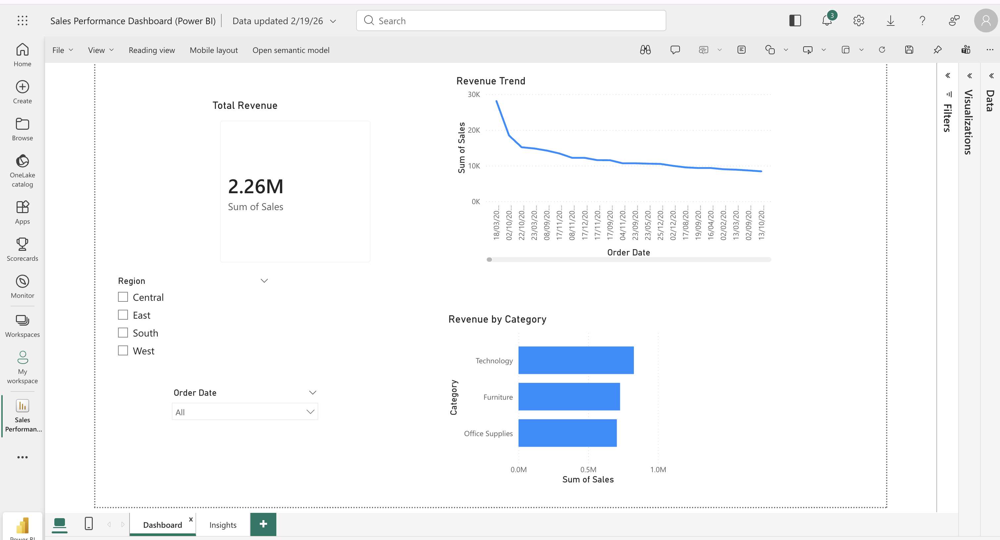
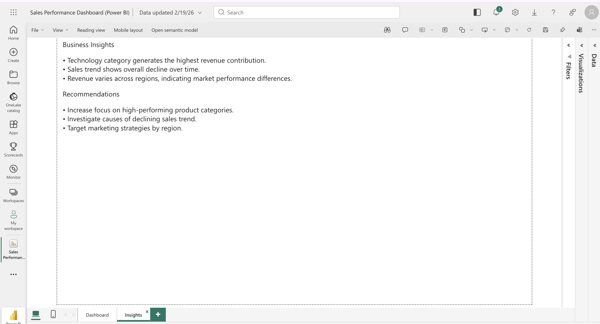

# Sales Performance Dashboard (Power BI)

## Overview
This project is an interactive business intelligence dashboard built using Microsoft Power BI to analyze sales performance data. The dashboard provides insights into revenue trends, product category performance, and regional sales metrics to support data-driven decision-making.

## Objectives
- Analyze sales performance across time and product categories
- Track key revenue metrics
- Identify business trends and performance patterns
- Provide actionable business insights

## Tools Used
- Microsoft Power BI (Web)
- Data Visualization
- Business Intelligence Reporting
- Data Analysis

## Dashboard Features

### Key Performance Indicators
- Total Revenue tracking
- Revenue trend over time
- Revenue distribution by product category

### Interactive Analysis
- Region filter for geographic performance analysis
- Order date filter for time-based analysis
- Dynamic dashboard visuals

### Business Insights
- Identified top-performing product categories
- Analyzed revenue trends over time
- Generated recommendations for business strategy improvements

## Results and Insights
- Technology category generates the highest revenue contribution
- Sales trend shows overall decline over time
- Revenue varies across regions, indicating market performance differences

## Recommendations
- Increase focus on high-performing product categories
- Investigate causes of declining sales trends
- Implement targeted marketing strategies by region

## Project Structure

## Screenshots

### Dashboard View

### Business Insights

